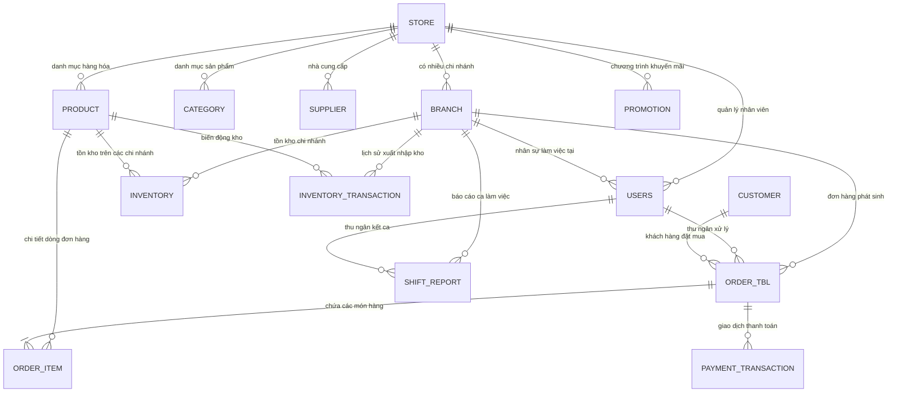

# Tài Liệu Cấu Trúc Cơ Sở Dữ Liệu & Quy Trình Migration (SkyPOS)

Hệ thống SkyPOS sử dụng hệ quản trị cơ sở dữ liệu quan hệ **MySQL 8.0+** với cơ chế quản lý version migration tự động thông qua **Flyway**.

---

## 1. Sơ Đồ Thực Thể Quan Hệ (Entity Relationship Model)



---

## 2. Chi Tiết Các Bảng Dữ Liệu Cốt Lõi

### 2.1. Cấu Trúc Hệ Thống & Quản Trị Tổ Chức
| Tên Bảng | Khóa Chính | Mô Tả & Quan Hệ Chính |
|---|---|---|
| `store` | `id (UUID / BINARY(16))` | Doanh nghiệp / Cửa hàng tổng. Quản lý bởi `store_admin_id`. |
| `branch` | `id (UUID / BINARY(16))` | Chi nhánh cửa hàng thuộc `store_id`. Có thông tin giờ mở cửa, đóng cửa, nhân sự quản lý. |
| `users` | `id (UUID / BINARY(16))` | Tài khoản người dùng (Admin, Manager, Cashier, Inventory Staff). Liên kết `store_id`, `branch_id`. |
| `customer` | `id (UUID / BINARY(16))` | Khách hàng thành viên, tích điểm, hạn mức công nợ. |

### 2.2. Hàng Hóa & Quản Lý Kho Vận
| Tên Bảng | Khóa Chính | Mô Tả & Quan Hệ Chính |
|---|---|---|
| `category` | `id (UUID / BINARY(16))` | Danh mục phân cấp cây (hỗ trợ `parent_id`), slug URL. |
| `supplier` | `id (UUID / BINARY(16))` | Nhà cung cấp hàng hóa, mã số thuế, công nợ. |
| `product` | `id (UUID / BINARY(16))` | Thông tin sản phẩm, mã SKU, Barcode, Giá vốn, Giá bán, Thuế VAT, Ngưỡng tồn tối thiểu (`min_stock_level`). |
| `inventory` | `id (UUID / BINARY(16))` | Số lượng tồn kho thực tế của từng sản phẩm tại từng chi nhánh (`product_id` + `branch_id`). |
| `inventory_transaction` | `id (UUID / BINARY(16))` | Sổ cái nhật ký kho: nhập kho, xuất kho bán hàng, điều chỉnh kiểm kê, hủy hàng. Ghi nhận `balance_after`, nhân viên thao tác. |

### 2.3. Bán Hàng, Giao Dịch & Thanh Toán
| Tên Bảng | Khóa Chính | Mô Tả & Quan Hệ Chính |
|---|---|---|
| `order_tbl` | `id (UUID / BINARY(16))` | Đơn hàng POS: mã đơn (`order_number`), tổng tiền, thuế, giảm giá, thu ngân, chi nhánh, trạng thái (`PENDING`, `COMPLETED`, `CANCELLED`). |
| `order_item` | `id (UUID / BINARY(16))` | Chi tiết từng sản phẩm trong hóa đơn (`order_id`, `product_id`, `quantity`, `price`). |
| `payment_transaction` | `id (UUID / BINARY(16))` | Giao dịch thanh toán: Tiền mặt, Thẻ ngân hàng, Stripe Gateway (`charge_id`, `receipt_url`, `refunded_amount`, `stripe_refund_id`). |
| `shift_report` | `id (UUID / BINARY(16))` | Báo cáo ca thu ngân: Tiền đầu ca, Doanh thu tiền mặt, Doanh thu thẻ, Tiền thực tế bàn giao, Chênh lệch ca. |
| `promotion` | `id (UUID / BINARY(16))` | Chương trình khuyến mãi, voucher giảm giá theo %, giá cố định, ngày hiệu lực và số lần sử dụng. |

---

## 3. Quy Trình Quản Lý Database Migration Với Flyway

Thư mục chứa script: `src/main/resources/db/migration`

### Danh sách các bản Migration:
1. **`V1__init_schema.sql`**: Khởi tạo cấu trúc bảng ban đầu chuẩn hoá chuẩn InnoDB UTF8MB4.
2. **`V2__seed_initial_data.sql`**: Dữ liệu hạt giống cho môi trường phát triển (cửa hàng mẫu, quản trị viên mặc định).
3. **`V3__performance_indexes.sql`**: Bộ chỉ mục hiệu năng cao (Composite indexes cho tìm kiếm nhanh SKU, Barcode, ngày tạo đơn).
4. **`V4__add_stripe_payment_fields.sql`**: Bổ sung các trường thanh toán trực tuyến quốc tế Stripe (Charge ID, Refund ID, Receipt URL, Trạng thái hoàn tiền).

### Kích hoạt Flyway trong các môi trường:
- **Môi trường Phát triển (Local Dev)**:
  ```properties
  spring.flyway.enabled=true
  spring.flyway.baseline-on-migrate=true
  spring.flyway.baseline-version=0
  ```
- **Môi trường Production**:
  ```properties
  spring.flyway.enabled=true
  spring.flyway.validate-on-migrate=true
  spring.jpa.hibernate.ddl-auto=validate
  ```
  > **Lưu ý triển khai Production**: Tuyệt đối không để `ddl-auto=create` hoặc `update`. Luôn để `validate` để đảm bảo Flyway toàn quyền kiểm soát thay đổi schema một cách an toàn và có thể rollback/audit được.
